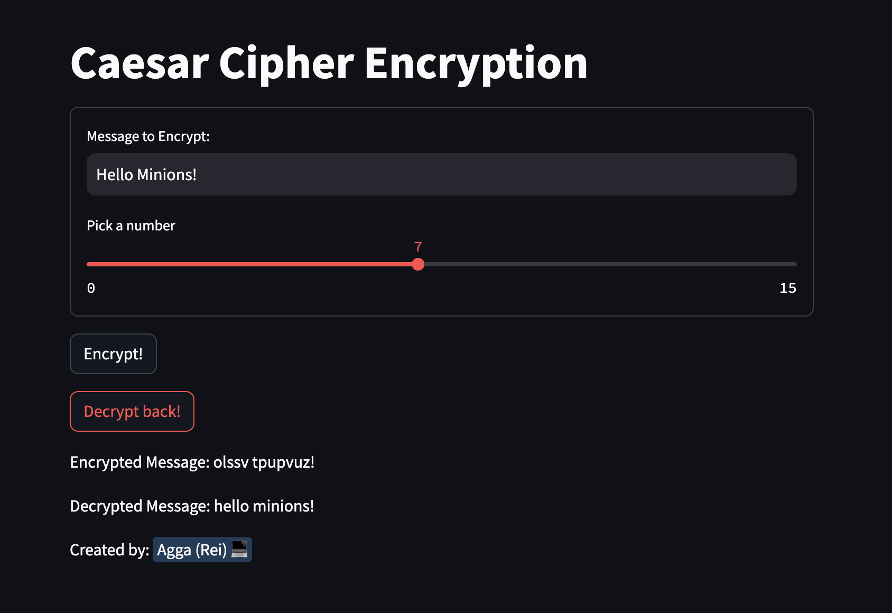

# Ceasar Cypher in Python



## Introduction

This repository is for experiencing how ceasar cyphter works.
<br>
The code is directly hosted on the streamlit. So, if you want to experience on web, please access directly from this [streamlit app].(https://caesercypher.streamlit.app/)

## Accessing with Code

You can clone or fork the repository as you like. And, please run the below code.
```
cd cesar_cypher
streamlit run cesar_cyphter.py
```

If my code was helpful, please don't forget to give this repository a star! 🌟🌟🌟